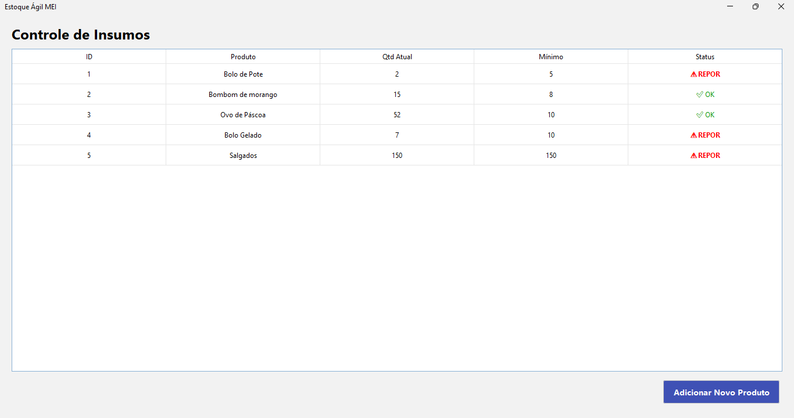

# Estoque Ágil MEI


Sistema de controle de estoque simplificado desenvolvido para microempreendedores que precisam gerenciar insumos e receber alertas de reposição.

## Deploy e Execução
Conforme as diretrizes do projeto, por se tratar de uma aplicação **Java Desktop (GUI)**, o deploy é baseado na geração do artefato executável:

1.  **Tipo de Deploy:** Arquivo executável (`.jar`).
2.  **Como gerar:** No terminal, utilize o comando `mvn package` para gerar o arquivo na pasta `/target`.
3.  **Link da Aplicação:** O código-fonte estável e a pipeline de CI encontram-se na branch `main` deste repositório.

## Tecnologias Utilizadas
- **Java 21**
- **Maven** (Gerenciamento de dependências)
- **H2 Database** (Persistência de dados local)
- **JUnit 5** (Testes automatizados)
- **GitHub Actions** (Integração Contínua)
- **Checkstyle** (Análise estática de código)
- **API ViaCEP** (Integração de endereços)
- **PostgreSQL** (Banco de dados em nuvem via Supabase)
- **Supabase** (DBaaS — Database as a Service)

## Funcionalidades
- Cadastro de produtos com ID, Nome, Quantidade Atual e Mínima.
- Listagem de estoque com alertas visuais [⚠️ REPOR].
- Persistência em arquivo local (H2 Database).
- Integração ViaCEP: Busca automática de Logradouro, Bairro e Cidade através do CEP no cadastro de fornecedores.

## Como Rodar o Projeto
1. Clone o repositório:
   ```bash
   git clone [https://github.com/dudamarquesst/estoque-agil-mei.git](https://github.com/dudamarquesst/estoque-agil-mei.git)

2. Certifique-se de ter o Java 21 instalado.

3. No terminal, execute:

   ```bash

   .\mvnw compile

   .\mvnw exec:java "-Dexec.mainClass=com.estoque.ui.Main"

## Interface do Sistema 



## Novas Funcionalidades

Integração ViaCEP: Agora o sistema realiza a busca automática de endereços (Logradouro, Bairro e Cidade) ao informar o CEP no cadastro de fornecedores/produtos.

## Banco de Dados
O sistema utiliza PostgreSQL hospedado no Supabase (nuvem).
As credenciais de acesso são gerenciadas via variáveis de ambiente
e GitHub Secrets, garantindo segurança das informações sensíveis.

## Equipe
| Integrante | GitHub |
|------------|--------|
| Duda Marques | @dudamarquesst |
| Murilo | @jorgemuriloceub |
| Lucas Gabriel | @LucasGabrielPaes |
| Miguel | @filemoura |
